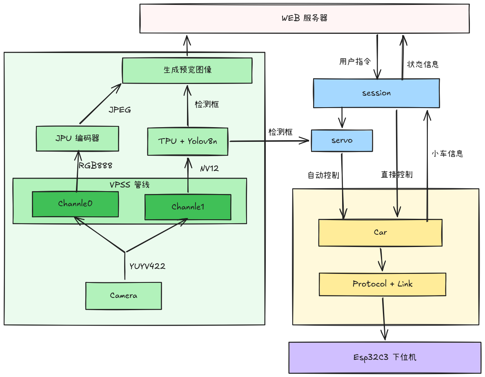

# SG2002 智能小车

基于 **LicheeRV Nano（SG2002）** 与 **ESP32-C3** 的视觉追踪小车：

- **上位机**（`sg2002-upper/`，Rust）：USB 相机 → VPSS 硬件 CSC → TPU 跑
  YOLOv8 网球检测；网页遥控 + 自动视觉伺服；
- **下位机**（`esp32c3-slave/`，Rust no_std）：双电机 PID 闭环 + 编码器里程，
  经 UART 接收速度意图并回传状态；
- **协议**（`protocol/`）：上下位机共用的线协议 crate，带校验和与逐条 ACK。

## 特性

- **VPSS 硬件管线**：相机 YUYV 只 memcpy 一次进 VB 块，硬件 CSC 一路两出 ——
  chn0 RGB 平面**零拷贝**喂 TPU，chn1 NV12 直连 VENC **硬编 JPEG**；
- **同帧预览**：网页画面与检测框严格同帧（按帧 PTS 配对），框不会画错帧；
- **手动 / 自动**：WASD 遥控（油门/转向斜坡 + 输入看门狗）；自动视觉伺服
  （丢失目标原地搜索、近距刹车、观测过期滑行）；
- **网页遥控**：单文件前端（无外部资源），HTTP 上行走按键/动作/模式，
  WebSocket 只做状态与视频推送；
- **失败即报错**：视觉/模型/串口任何一步启动失败直接退出，没有静默降级。

## 架构



## 仓库结构

```
├── protocol/          # 上下位机共享的线协议（no_std，唯一协议实现）
├── sg2002-upper/      # 上位机：视觉 + 控制 + 网页（板端 Linux/RISC-V）
│   ├── cvimpi-rs/     # cvi_mpi 薄封装（VPSS/VENC/VDEC ioctl + Sys/VB 池）
│   ├── cviruntime-rs/ # TPU runtime 封装
│   └── src/{vision,control,transport,web}/
└── esp32c3-slave/     # ESP32-C3 固件（no_std + embassy）+ Python 试车工具
```

## 硬件

| 部件 | 说明 |
|---|---|
| LicheeRV Nano（SG2002） | 上位机，跑视觉与网页服务 |
| USB 摄像头 | YUYV 640x480（与模型输入一致） |
| ESP32-C3 | 下位机，双电机 + 正交编码器 |
| 接线 | 上位机 UART1（GPIOA18/A19，`sg2002-upper/scripts/pinmux.sh`）↔ ESP32 UART0（115200 8N1） |

## 快速开始

### 上位机

```sh
# 主机：交叉编译并部署到板端 /root（默认 root@192.168.1.2）
cd sg2002-upper && ./flash.sh

# 板端：运行（模型自动查找 /root/*.cvimodel）
ssh root@192.168.1.2 '/root/smartcar --bind 192.168.1.2'
# 浏览器打开 http://192.168.1.2/
```

### 固件

```sh
cd esp32c3-slave
cargo run --release          # espflash 烧录 + 串口监视（默认 UART 链路）
# BLE 链路（试车用）：cargo run --release --no-default-features --features ble
```
